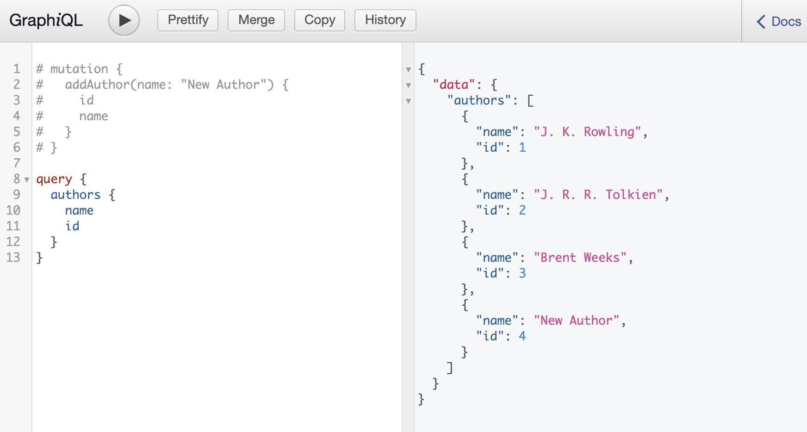

# express-graphql-practice



This is a practice from [Web Dev Simplified](https://www.youtube.com/watch?v=ZQL7tL2S0oQ&ab_channel=WebDevSimplified). Serve a service by using express and GraphQL.

## 🛠️ Build Setup

```bash
# install dependencies
$ npm install

# serve with hot reload at localhost:3000
$ npm run dev
```

## Call Server api by using fetch

```bash
    const response = await fetch("http://localhost:5000/graphql", {
        method: "POST",
        headers: {
            "Content-Type": "application/json",
        },
        body: JSON.stringify({
            query: `
                query {
                    authors {
                        name
                    }
                }
            `,
            variables: {
                now: new Date().toISOString(),
            },
        }),
    });
    const result = await response.json();
    console.log(result.data.authors);
```
